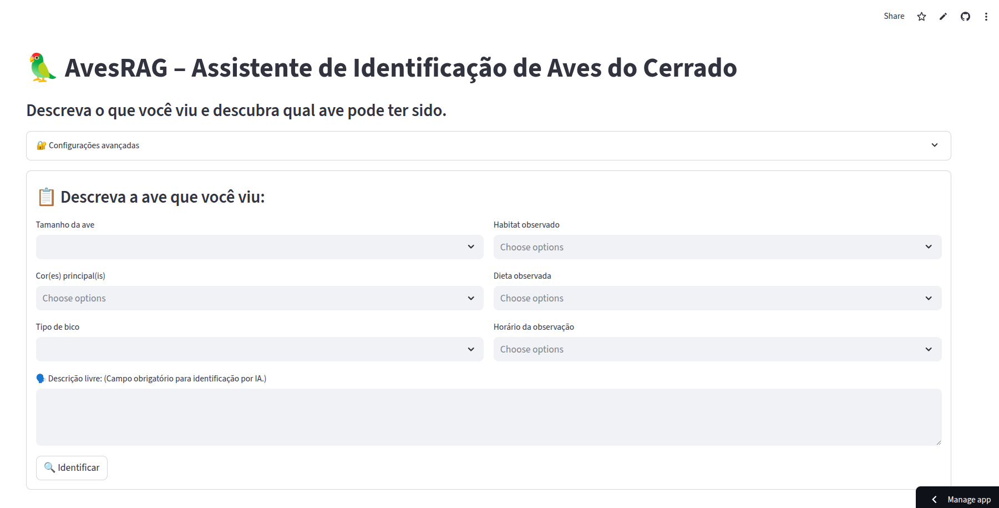
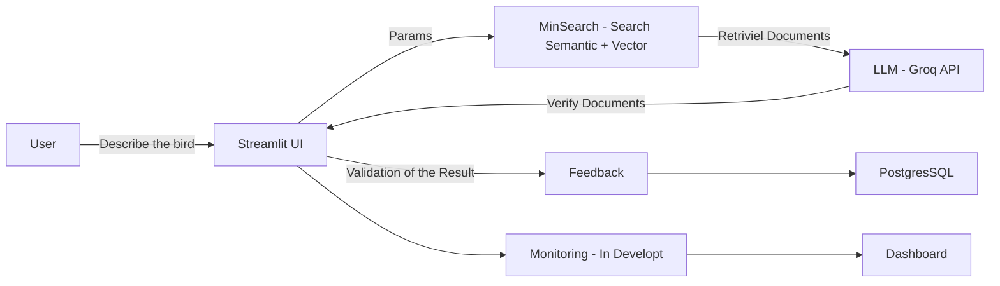

# 🦜 AvesRAG – Bird Identification Assistant Cerrado


[](https://www.python.org/)
[](https://streamlit.io/)
[](#)
[](LICENSE)

> 🏆 Project developed for the course **LLM Zoomcamp** by [DataTalks.Club](https://datatalks.club)

> > 🇧🇷 Este README também está disponível em [Português](README.md).

## 📌 Problem

Existing bird identification applications generally work with photos or sounds. However, observers are not always able to capture an image or recording at the time of sighting.
In these situations, the only available reference is the visual description of the bird, such as color, size, beak shape, or behavior.
AvesRAG was created to address this exact scenario, allowing bird identification based on text descriptions.

## 📌 About the Project

The **AvesRAG Assistant** is an interactive intelligent assistant that aims to solve this problem by identifying birds based on user-provided descriptions. Using the **RAG (Retrieval-Augmented Generation)** technique, it searches for information in a custom database and returns **up to 3 candidate species** with summarized descriptions.

---
## 🖼 Interface Preview



## 🎯 Objectives

* Create an interactive tool for bird identification.
* Use RAG to combine structured search and text generation via LLM.
* Ensure the backend and pipeline are modular and easy to adapt.
* Collect user feedback to continuously improve results (In development).

## 📊 Database

The database used was created from:

* Integration of existing databases.
* Scraping from online sources.
* Data parameterization via LLM.

📂 Database Builder Repository: [rafaelladuarte/avesrag-dataset-builder](https://github.com/rafaelladuarte/avesrag-dataset-builder)

## 🧩 System Architecture



## ✨ Features

✅ Data entry via form with validation. \
✅ Optimized search with MinSearch (semantic + textual). \
✅ Return of **up to 3 candidate species**. \
✅ Automatic species summary with images.\
✅  User feedback collection\
🔄 Monitoring LLM usage - API.

## 🔬 Evaluation

### 🔎 Retrieval

* **Tests performed**:
    * BM25 (textual)
    * Vector (embeddings)
    * Hybrid search (best result)

* **Result**: Hybrid search showed higher recall and precision for short descriptions.

### 🧠 LLM

* Different open-source models evaluated. * `llama-3.1-8b-instant`
* `gemma2-9b-it`
* `deepseek-r1-distill-llama-70b`
* Tested *zero-shot* vs *few-shot* prompts.
* **Result**: `llama-3.1-8b-instant` with *few-shot* had a better balance between cost and accuracy.

## 📊 Feedback and Monitoring (in development)

* User feedback collection (yes/no on answer usefulness).
* Storage in PostgreSQL
* Streamlit dashboard with metrics:
    * Number of queries
    * Most searched species
    * Accepted answer rate
    * Average response time

## 🛠 Technologies Used

| Category                | Tools                                                                                                             |
| ------------------------ | ----------------------------------------------------------------------------------------------------------------------- |
| **Linguagem**            | Python 3.11+                                                                                                            |
| **Framework Web**        | [Streamlit](https://streamlit.io/)                                                                                      |
| **LLM (Assistente)**     | `llama-3.1-8b-instant`                                                                                                  |
| **LLMs (Base de dados)** | `gemma2-9b-it`, `deepseek-r1-distill-llama-70b`, `llama-3.1-8b-instant` |
| **Backend de Busca**     | [MinSearch](https://github.com/alexeygrigorev/minsearch) *(adaptado)*                                                   |
| **API LLM**              | [Groq API](https://groq.com/)                                                                                           |
| **Processamento**        | pandas, numpy                                                                                                           |
| **Controle de Versão**   | Git + GitHub                                                                                                            |

## 📂 Project Structure

```
📦 averag-assistant
├── app.py                # Arquivo principal da aplicação 
├── dev.py                # Script auxiliar para desenvolvimento e testes locais
├── docs/                 # Documentação do projeto
│   ├── images/           # Imagens usadas na documentação
│   └── notes/            # Anotações, rascunhos e referências
├── Pipfile               # Definições de dependências (Pipenv)
├── Pipfile.lock          # Lockfile de dependências
├── requirements.txt      # Alternativa de dependências para instalação via pip
├── README.md             # Documentação principal (Português)
├── README_ENG.md         # Documentação principal (Inglês)
├── .gitignore            # Arquivos e pastas ignorados pelo Git
├── script/               # Scripts organizados por domínio
│   ├── api/              # Código relacionado a integração com APIs externas
│   ├── data/             # Base de dados utilizada para RAG em json
│   ├── database/         # Conexão e operações no banco de dados
│   ├── notebooks/        # Jupyter Notebooks para análises e experimentos
│   ├── services/        # Scripts da interface Streamlit
│   └── utils/           # Funções auxiliares e utilitários genéricos
└── venv/                 

```

## ⚙️ Installation and Execution

### 1. Clone the repository

```bash
git clone https://github.com/usuario/avesrag-assistant.git
cd avesrag-assistant
```

### 2. Create the virtual environment and install dependencies

```bash
python -m venv venv
source venv/bin/activate # Linux/Mac
source venv\Scripts\activate # Windows
pip install -r requirements.txt
```

### 3. Configure environment variables

Create an `.env` file with:

```
GROQ_API_KEY1="yourkeyhere"
GROQ_API_KEY2="yourkeyhere"
POSTGRES_URL="yourkeyhere"
```

### 4. Run the application

```bash
streamlit run app.py
```

## 📈 Evaluation Criteria Met

* [x] Problem clearly described
* [x] Knowledge base + LLM in the flow
* [x] Evaluation of multiple retrieval flows
* [x] Evaluation of different prompts/models
* [x] Streamlit interface
* [ ] Automated ingestion via Python scripts
* [x] Monitoring with feedback
* [ ] Monitoring with use LLM  + dashboard
* [ ] Containerization with Docker
* [x] Reproducibility (instructions + requirements)

## 📈 Next Steps

* 🔧 Adjust search weights and parameters in MinSearch
* 🐦 Expand the database to more Brazilian species
* 🧪 Create unit and integration tests
* 📊 Add query logging and monitoring

## 📜 License

Distributed under the MIT license. See the [LICENSE] file for more details.