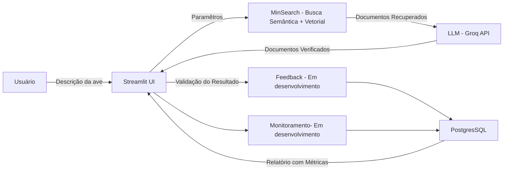

# 🦜 AvesRAG – Assistente de Identificação de Aves do Cerrado


[](https://www.python.org/)
[](https://streamlit.io/)
[](#)
[](LICENSE)

> 🏆 Projeto desenvolvido para o curso **LLM Zoomcamp** da [DataTalks.Club](https://datatalks.club)

👉 [README in English](README_ENG.md)


## 📌 Problema 

Os aplicativos de identificação de aves existentes funcionam, em geral, com fotos ou sons. No entanto, nem sempre o observador consegue registrar uma imagem ou gravação no momento do avistamento.
Nessas situações, a única referência disponível é a descrição visual da ave, como por exemplo: cor, tamanho, formato do bico ou comportamento.
O AvesRAG foi criado para atender exatamente esse cenário, permitindo a identificação de aves a partir de descrições em texto.

## 📌 Sobre o Projeto

O **AvesRAG Assistant** é um assistente inteligente interativo busca resolver esse problema, ele capaz de **identificar aves** com base em descrições fornecidas pelo usuário. Utilizando a técnica de **RAG (Retrieval-Augmented Generation)**, ele busca informações em uma base de dados personalizada e retorna **até 3 espécies candidatas** com descrições resumidas.

---
## 🖼 Prévia da Interface

> *(Adicione aqui um print da aplicação rodando)*


## 🎯 Objetivos

* Criar uma ferramenta interativa para identificação de aves.
* Utilizar RAG para combinar **busca estruturada** e **geração de texto por LLM**.
* Garantir que o backend e o pipeline sejam modulares e fáceis de adaptar.
* Coletar feedback dos usuários para melhorar continuamente os resultados (Em desenvolvimento).

## 📊 Base de Dados

A base de dados utilizada foi criada a partir de:

* Integração de **bases já existentes**.
* **Scraping** de fontes online.
* **Parametrização de dados via LLM**.

📂 Repositório do construtor da base:
➡ [rafaelladuarte/avesrag-dataset-builder](https://github.com/rafaelladuarte/avesrag-dataset-builder)

## 🧩 Arquitetura do Sistema



## ✨ Funcionalidades

✅ Entrada de dados via formulário com validação . \
✅ Busca otimizada com MinSearch (semântica + textual). \
✅ Retorno de **até 3 espécies candidatas**. \
✅ Resumo automático das espécies com imagens.\
✅  Coleta de feedback do usuário\
🔄 Monitoramento do uso da LLM - API.

## 🔬 Evaluation

### 🔎 Retrieval

* **Tests performed**:

* BM25 (textual)
* Vector (embeddings)
* Hybrid search (best result)
* **Result**: Hybrid search showed higher recall and precision for short descriptions.

### 🧠 LLM

* Different open-source models evaluated. * `llama-3.1-8b-instant`
* `gemma2-9b-it`
* `deepseek-r1-distill-llama-70b`
* Tested *zero-shot* vs *few-shot* prompts.
* **Result**: `llama-3.1-8b-instant` with *few-shot* had a better balance between cost and accuracy.

## 📊 Feedback and Monitoring (in development)

* User feedback collection (yes/no on answer usefulness).
* Storage in PostgreSQL
* Streamlit dashboard with metrics:

* Number of queries
* Most searched species
* Accepted answer rate
* Average response time


## 🛠 Technologies Used

| Category                | Tools                                                                                                             |
| ------------------------ | ----------------------------------------------------------------------------------------------------------------------- |
| **Linguagem**            | Python 3.11+                                                                                                            |
| **Framework Web**        | [Streamlit](https://streamlit.io/)                                                                                      |
| **LLM (Assistente)**     | `llama-3.1-8b-instant`                                                                                                  |
| **LLMs (Base de dados)** | `gemma2-9b-it`, `deepseek-r1-distill-llama-70b`, `llama-3.1-8b-instant` |
| **Backend de Busca**     | [MinSearch](https://github.com/alexeygrigorev/minsearch) *(adaptado)*                                                   |
| **API LLM**              | [Groq API](https://groq.com/)                                                                                           |
| **Processamento**        | pandas, numpy                                                                                                           |
| **Controle de Versão**   | Git + GitHub                                                                                                            |

## 📂 Project Structure

```
📦 averag-assistant
├── app.py                # Arquivo principal da aplicação 
├── dev.py                # Script auxiliar para desenvolvimento e testes locais
├── docs/                 # Documentação do projeto
│   ├── images/           # Imagens usadas na documentação
│   └── notes/            # Anotações, rascunhos e referências
├── Pipfile               # Definições de dependências (Pipenv)
├── Pipfile.lock          # Lockfile de dependências
├── requirements.txt      # Alternativa de dependências para instalação via pip
├── README.md             # Documentação principal (Português)
├── README_ENG.md         # Documentação principal (Inglês)
├── .gitignore            # Arquivos e pastas ignorados pelo Git
├── script/               # Scripts organizados por domínio
│   ├── api/              # Código relacionado a integração com APIs externas
│   ├── data/             # Base de dados utilizada para RAG em json
│   ├── database/         # Conexão e operações no banco de dados
│   ├── notebooks/        # Jupyter Notebooks para análises e experimentos
│   ├── services/        # Scripts da interface Streamlit
│   └── utils/           # Funções auxiliares e utilitários genéricos
└── venv/                 

```

## ⚙️ Installation and Execution

### 1. Clone the repository

```bash
git clone https://github.com/usuario/avesrag-assistant.git
cd avesrag-assistant
```

### 2. Create the virtual environment and install dependencies

```bash
python -m venv venv
source venv/bin/activate # Linux/Mac
source venv\Scripts\activate # Windows
pip install -r requirements.txt
```

### 3. Configure environment variables

Create an `.env` file with:

```
GROQ_API_KEY="yourkeyhere"
POSTGRES_URL="yourkeyhere"
```

### 4. Run the application

```bash
streamlit run app.py
```

## 📈 Evaluation Criteria Met

* [x] Problem clearly described
* [x] Knowledge base + LLM in the flow
* [x] Evaluation of multiple retrieval flows
* [x] Evaluation of different prompts/models
* [x] Streamlit interface
* [ ] Automated ingestion via Python scripts
* [ ] Monitoring with feedback + dashboard
* [ ] Containerization with Docker
* [x] Reproducibility (instructions + requirements)

## 📈 Next Steps

* 🔧 Adjust search weights and parameters in MinSearch
* 🐦 Expand the database to more Brazilian species
* 🧪 Create unit and integration tests
* 📊 Add query logging and monitoring

## 📜 License

Distributed under the MIT license. See the [LICENSE] file for more details.