# 🦜 AvesRAG – Assistente de Identificação de Aves do Cerrado

[](https://www.python.org/)
[](https://streamlit.io/)
[](#)
[](LICENSE)

> 🏆 Projeto desenvolvido para o **LLM Zoomcamp** da [DataTalks.Club](https://datatalks.club)

---

## 🖼 Prévia da Interface

> *(Adicione aqui um print da aplicação rodando)*


---
## 📌 Problema 

Os aplicativos de identificação de aves existentes funcionam, em geral, com fotos ou sons. No entanto, nem sempre o observador consegue registrar uma imagem ou gravação no momento do avistamento.
Nessas situações, a única referência disponível é a descrição visual da ave, como por exemplo: cor, tamanho, formato do bico ou comportamento.
O AvesRAG foi criado para atender exatamente esse cenário, permitindo a identificação de aves a partir de descrições em texto.

## 📌 Sobre o Projeto

O **AvesRAG Assistant** é um assistente inteligente interativo busca resolver esse problema, ele capaz de **identificar aves** com base em descrições fornecidas pelo usuário. Utilizando a técnica de **RAG (Retrieval-Augmented Generation)**, ele busca informações em uma base de dados personalizada e retorna **até 3 espécies candidatas** com descrições resumidas.

---

## 🎯 Objetivos

* Criar uma ferramenta interativa para identificação de aves.
* Utilizar RAG para combinar **busca estruturada** e **geração de texto por LLM**.
* Garantir que o backend e o pipeline sejam modulares e fáceis de adaptar.
* Coletar feedback dos usuários para melhorar continuamente os resultados (Em desenvolvimento).
---

## 📊 Base de Dados

A base de dados utilizada foi criada a partir de:

* Integração de **bases já existentes**.
* **Scraping** de fontes online.
* **Parametrização de dados via LLM**.

📂 Repositório do construtor da base:
➡ [rafaelladuarte/avesrag-dataset-builder](https://github.com/rafaelladuarte/avesrag-dataset-builder)

---

## 🧩 Arquitetura do Sistema

```mermaid
flowchart LR
    A[Usuário] -->|Descrição da ave| B[Streamlit UI]
    B --> C[RAG Pipeline]
    C --> D[MinSearch - Vetores/Textos]
    D --> C
    C --> E[LLM - Groq API]
    E --> B
    B --> F[Feedback & Monitoramento - Em desenvolvimento]
```



---
## ✨ Funcionalidades

✅ Entrada de dados via formulário com validação . \
✅ Busca otimizada com MinSearch (semântica + textual). \
✅ Retorno de **até 3 espécies candidatas**. \
✅ Resumo automático das espécies com imagens.\
🔄 Coleta de feedback do usuário (“Essa resposta foi útil?”)

---
## 🔬 Avaliação

### 🔎 Retrieval

* **Testes realizados**:

  * BM25 (textual)
  * Vetorial (embeddings)
  * Busca híbrida (melhor resultado)
* **Resultado**: busca híbrida apresentou maior recall e precisão para descrições curtas.

### 🧠 LLM

* Avaliados diferentes modelos (`llama`, `gemma`, `deepseek`).
* Testados prompts *zero-shot* vs *few-shot*.
* **Resultado**: `llama-3.1-8b-instant` com *few-shot* teve melhor equilíbrio entre custo e precisão.

---
## 📊 Monitoramento (em desenvolvimento)

* Coleta de feedback de usuários (sim/não sobre utilidade da resposta).
* Armazenamento em JSON/SQLite.
* Dashboard no Streamlit com métricas:

  * Nº de consultas
  * Espécies mais buscadas
  * Taxa de respostas aceitas
  * Tempo médio de resposta

---
## 🛠 Tecnologias Utilizadas

| Categoria                | Ferramentas                                                                                                             |
| ------------------------ | ----------------------------------------------------------------------------------------------------------------------- |
| **Linguagem**            | Python 3.11+                                                                                                            |
| **Framework Web**        | [Streamlit](https://streamlit.io/)                                                                                      |
| **LLM (Assistente)**     | `llama-3.1-8b-instant`                                                                                                  |
| **LLMs (Base de dados)** | `gemma2-9b-it`, `deepseek-r1-distill-llama-70b`, `llama-3.1-8b-instant` |
| **Backend de Busca**     | [MinSearch](https://github.com/alexeygrigorev/minsearch) *(adaptado)*                                                   |
| **API LLM**              | [Groq API](https://groq.com/)                                                                                           |
| **Processamento**        | pandas, numpy                                                                                                           |
| **Controle de Versão**   | Git + GitHub                                                                                                            |

---

## 📂 Estrutura do Projeto

```
📦 avesrag-assistant
(desenvolvimento)
```
---
## ⚙️ Instalação e Execução

### 1. Clone o repositório

```bash
git clone https://github.com/usuario/avesrag-assistant.git
cd avesrag-assistant
```

### 2. Crie o ambiente virtual e instale dependências

```bash
python -m venv venv
source venv/bin/activate   # Linux/Mac
venv\Scripts\activate      # Windows
pip install -r requirements.txt
```

### 3. Configure variáveis de ambiente

Crie um arquivo `.env` com:

```
GROQ_API_KEY=suachaveaqui
```

### 4. Execute a aplicação

```bash
streamlit run app.py
```
---

## 📈 Critérios de Avaliação Atendidos

* [x] Problema descrito claramente
* [x] Knowledge base + LLM no fluxo
* [x] Avaliação de múltiplos retrieval flows
* [x] Avaliação de diferentes prompts/modelos
* [x] Interface em Streamlit
* [ ] Ingestão automatizada via scripts Python
* [ ] Monitoramento com feedback + dashboard
* [ ] Containerização com Docker
* [x] Reprodutibilidade (instruções + requirements)

---

## 📈 Próximos Passos

* 🔧 Ajustar pesos e parâmetros de busca no MinSearch
* 🐦 Expandir base para mais espécies brasileiras
* 🧪 Criar testes unitários e de integração
* 📊 Adicionar logging e monitoramento de consultas

---

## 📜 Licença

Distribuído sob a licença MIT. Veja o arquivo [LICENSE](LICENSE) para mais detalhes.
