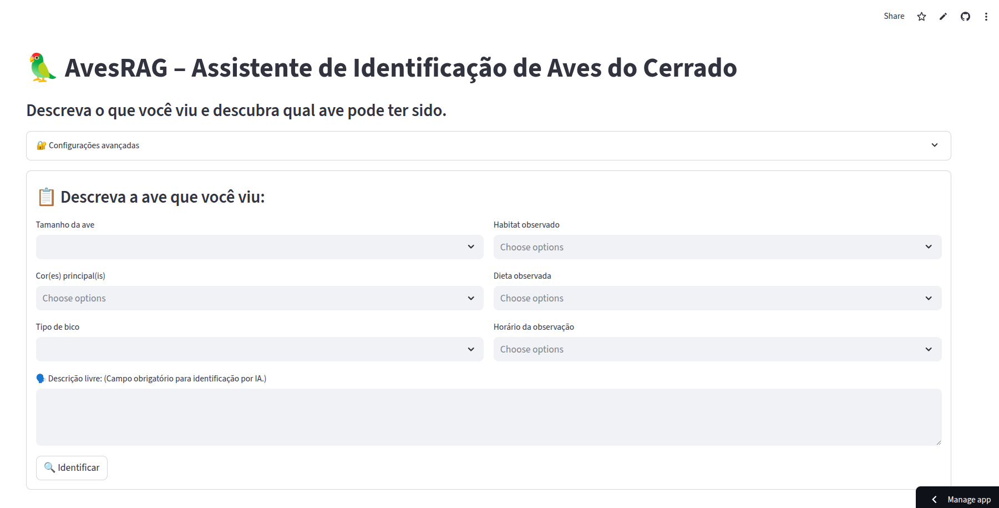
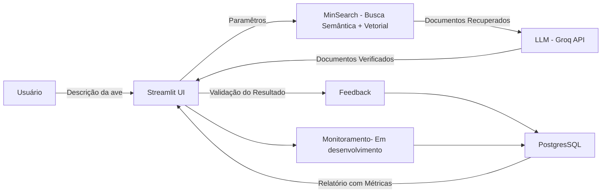

# 🦜 AvesRAG – Assistente de Identificação de Aves do Cerrado


[](https://www.python.org/)
[](https://streamlit.io/)
[](#)
[](LICENSE)

> 🏆 Project developed for the **LLM Zoomcamp** course from [DataTalks.Club](https://datatalks.club)

## 📌 Problem

Existing bird identification applications generally work with photos or sounds. However, observers are not always able to capture an image or recording at the time of sighting.
In these situations, the only available reference is the visual description of the bird, such as color, size, beak shape, or behavior.
AvesRAG was created to address this exact scenario, allowing bird identification based on text descriptions.

## 📌 About the Project

The **AvesRAG Assistant** is an interactive intelligent assistant that aims to solve this problem by identifying birds based on user-provided descriptions. Using the **RAG (Retrieval-Augmented Generation)** technique, it searches for information in a custom database and returns **up to 3 candidate species** with summarized descriptions.

---
## 🖼 Interface Preview

> *(Adicione aqui um print da aplicação rodando)*



## 🎯 Objectives

* Create an interactive tool for bird identification.
* Use RAG to combine structured search and text generation via LLM.
* Ensure the backend and pipeline are modular and easy to adapt.
* Collect user feedback to continuously improve results (In development).

## 📊 Database

The database used was created from:

* Integration of existing databases.
* Scraping from online sources.
* Data parameterization via LLM.


5.000 / 5.000
# 🦜 AvesRAG – Bird Identification Assistant Cerrado


[](https://www.python.org/)
[](https://streamlit.io/)
[](#)
[](LICENSE)

> 🏆 Project developed for the course **LLM Zoomcamp** by [DataTalks.Club](https://datatalks.club)

## 📌 Problem

Existing bird identification applications generally work with photos or sounds. However, observers are not always able to capture an image or recording at the time of sighting.
In these situations, the only available reference is the visual description of the bird, such as color, size, beak shape, or behavior.
AvesRAG was created to address this exact scenario, allowing bird identification based on text descriptions.

## 📌 About the Project

The **AvesRAG Assistant** is an interactive intelligent assistant that aims to solve this problem by identifying birds based on user-provided descriptions. Using the **RAG (Retrieval-Augmented Generation)** technique, it searches for information in a custom database and returns **up to 3 candidate species** with summarized descriptions.

---
## 🖼 Interface Preview

> *(Add a screenshot of the application running here)*


## 🎯 Objectives

* Create an interactive tool for bird identification.
* Use RAG to combine structured search and text generation via LLM.
* Ensure the backend and pipeline are modular and easy to adapt.
* Collect user feedback to continuously improve results (In development).

## 📊 Database

The database used was created from:

* Integration of existing databases.
* Scraping from online sources.
* Data parameterization via LLM.

📂 Database Builder Repository: [rafaelladuarte/avesrag-dataset-builder](https://github.com/rafaelladuarte/avesrag-dataset-builder)

## 🧩 System Architecture



## ✨ Features

✅ Data entry via form with validation. \
✅ Optimized search with MinSearch (semantic + textual). \
✅ Return of **up to 3 candidate species**. \
✅ Automatic species summary with images.\
✅  User feedback collection\
🔄 Monitoring LLM usage - API.

## 🔬 Avaliação

### 🔎 Retrieval

* **Testes realizados**:

  * BM25 (textual)
  * Vetorial (embeddings)
  * Busca híbrida (melhor resultado)
* **Resultado**: busca híbrida apresentou maior recall e precisão para descrições curtas.

### 🧠 LLM

* Avaliados diferentes modelos open-source.
  * `llama-3.1-8b-instant`
  * `gemma2-9b-it `
  * `deepseek-r1-distill-llama-70b`
* Testados prompts *zero-shot* vs *few-shot*.
* **Resultado**: `llama-3.1-8b-instant` com *few-shot* teve melhor equilíbrio entre custo e precisão.

## 📊 Feedback e Monitoramento (em desenvolvimento)

* Coleta de feedback de usuários (sim/não sobre utilidade da resposta).
* Armazenamento em PostgreSQL
* Dashboard no Streamlit com métricas:

  * Nº de consultas
  * Espécies mais buscadas
  * Taxa de respostas aceitas
  * Tempo médio de resposta

---
## 🛠 Tecnologias Utilizadas

| Categoria                | Ferramentas                                                                                                             |
| ------------------------ | ----------------------------------------------------------------------------------------------------------------------- |
| **Linguagem**            | Python 3.11+                                                                                                            |
| **Framework Web**        | [Streamlit](https://streamlit.io/)                                                                                      |
| **LLM (Assistente)**     | `llama-3.1-8b-instant`                                                                                                  |
| **LLMs (Base de dados)** | `gemma2-9b-it`, `deepseek-r1-distill-llama-70b`, `llama-3.1-8b-instant` |
| **Backend de Busca**     | [MinSearch](https://github.com/alexeygrigorev/minsearch) *(adaptado)*                                                   |
| **API LLM**              | [Groq API](https://groq.com/)                                                                                           |
| **Processamento**        | pandas, numpy                                                                                                           |
| **Controle de Versão**   | Git + GitHub                                                                                                            |

## 📂 Estrutura do Projeto

```
📦 avesrag-assistant
📦 averag-assistant
├── app.py                # Main application entry point
├── dev.py                # Auxiliary script for local development and testing
├── docs/                 # Project documentation
│   ├── images/           # Images used in the documentation
│   └── notes/            # Notes, drafts, and references
├── Pipfile               # Dependency definitions (Pipenv)
├── Pipfile.lock          # Dependency lockfile (ensures reproducibility)
├── requirements.txt      # Alternative dependency list for pip installation
├── README.md             # Main documentation (Portuguese)
├── README_ENG.md         # Main documentation (English)
├── .gitignore            # Files and folders ignored by Git
├── script/               # Scripts organized by domain
│   ├── api/              # Code related to external API integration
│   ├── data/             # Dataset used for RAG (in JSON format)
│   ├── database/         # Database connection and operations
│   ├── notebooks/        # Jupyter Notebooks for analysis and experiments
│   ├── services/         # Streamlit interface scripts
│   └── utils/            # Helper functions and general utilities
└── venv/                 # Python virtual environment (not versioned)
```

## ⚙️ Instalação e Execução

### 1. Clone o repositório

```bash
git clone https://github.com/usuario/avesrag-assistant.git
cd avesrag-assistant
```

### 2. Crie o ambiente virtual e instale dependências

```bash
python -m venv venv
source venv/bin/activate          # Linux/Mac
source venv\Scripts\activate      # Windows
pip install -r requirements.txt
```

### 3. Configure variáveis de ambiente

Crie um arquivo `.env` com:

```
GROQ_API_KEY="suachaveaqui"
POSTGRES_URL="suauriaqui"
```

### 4. Execute a aplicação

```bash
streamlit run app.py
```

## 📈 Critérios de Avaliação Atendidos

* [x] Problema descrito claramente
* [x] Knowledge base + LLM no fluxo
* [x] Avaliação de múltiplos retrieval flows
* [x] Avaliação de diferentes prompts/modelos
* [x] Interface em Streamlit
* [ ] Ingestão automatizada via scripts Python
* [ ] Monitoramento com feedback + dashboard
* [ ] Containerização com Docker
* [x] Reprodutibilidade (instruções + requirements)

## 📈 Próximos Passos

* 🔧 Ajustar pesos e parâmetros de busca no MinSearch
* 🐦 Expandir base para mais espécies brasileiras
* 🧪 Criar testes unitários e de integração
* 📊 Adicionar logging e monitoramento de consultas


## 📜 Licença

Distribuído sob a licença MIT. Veja o arquivo [LICENSE](LICENSE) para mais detalhes.